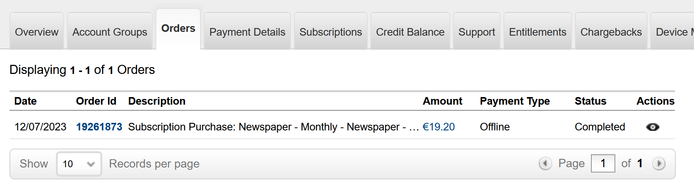
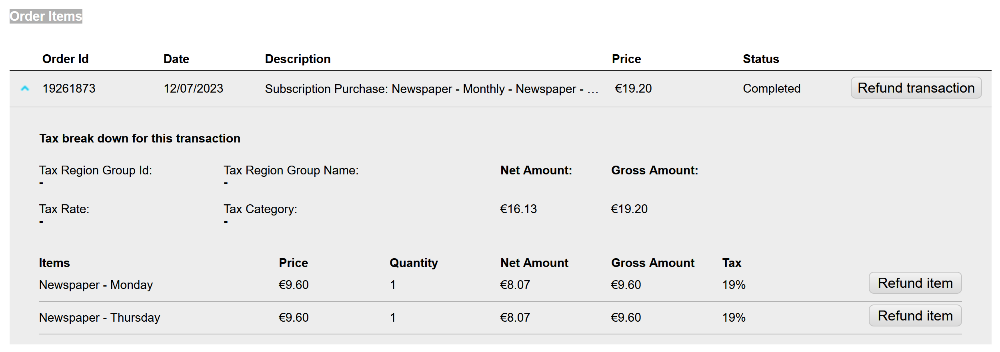
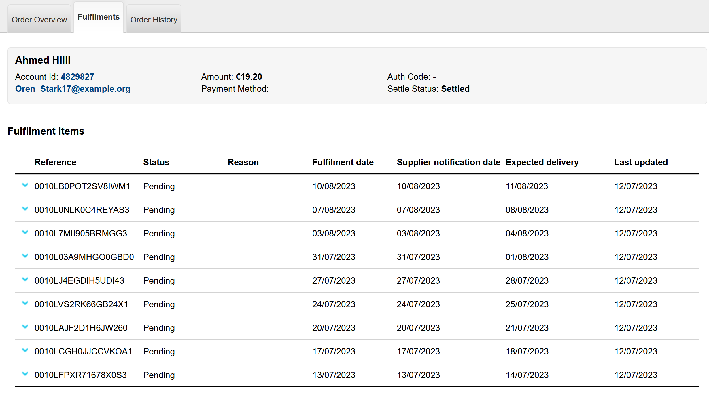
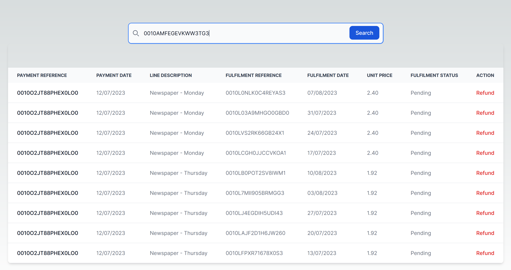
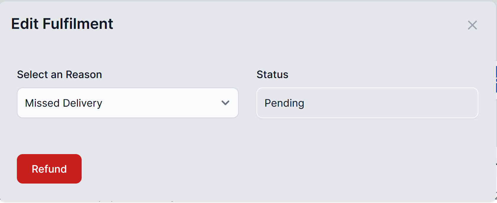
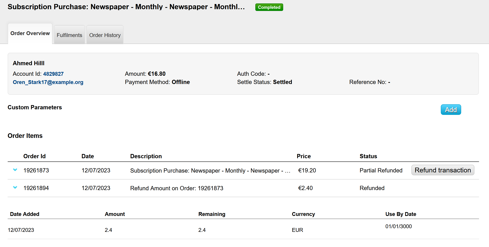
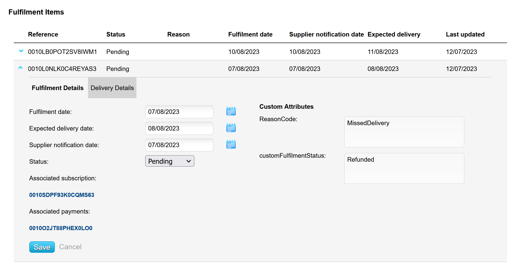
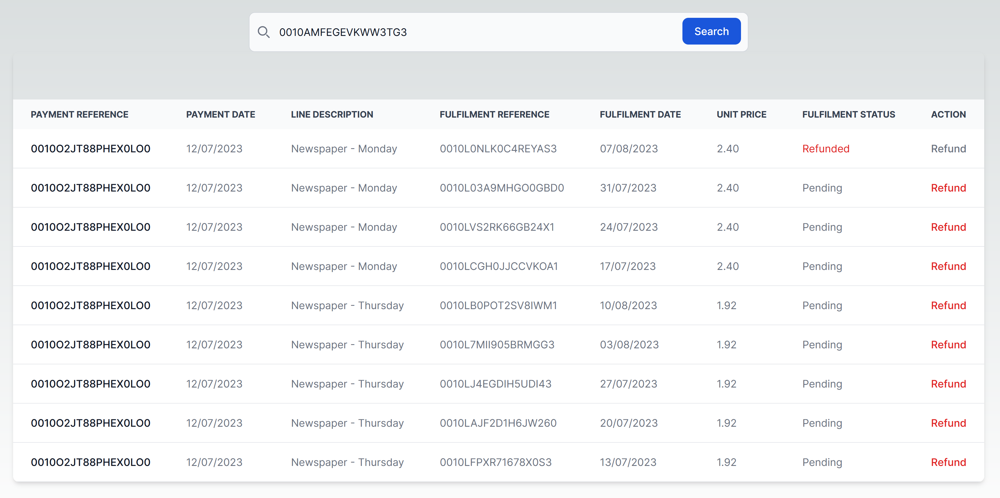

<div align="center">


  <h1>Aptitude eSuite Fulfilment Unit Price Example</h1>
  
  <p>
    This repo gives a simple demonstration of how unit price can be calculated and used to credit end user accounts
  </p>

<!-- Badges -->
<p>
<a href="https://github.com/craigashields/esuite-fulfilments-unit-pricing/graphs/contributors">
    
</a>
<a href="">
    
</a>
<a href="https://github.com/craigashields/esuite-fulfilments-unit-pricing/network/members">
    
</a>
<a href="https://github.com/craigashields/esuite-fulfilments-unit-pricing/stargazers">
    
</a>
<a href="https://github.com/craigashields/esuite-fulfilments-unit-pricing/issues/">
    
</a>
</p>  
<h4>
    <a href="https://github.com/craigashields/esuite-fulfilments-unit-pricing/">View Demo</a>
  <span> · </span>
    <a href="https://github.com/craigashields/esuite-fulfilments-unit-pricing">Documentation</a>
  <span> · </span>
    <a href="https://github.com/craigashields/esuite-fulfilments-unit-pricing/issues/">Report Bug</a>
  <span> · </span>
    <a href="https://github.com/craigashields/esuite-fulfilments-unit-pricing/issues/">Request Feature</a>
  </h4>
</div>

## Table of Contents

- [Disclaimer](#disclaimer)
- [Pre-Requisites](#prerequisites)
- [Description](#description)
- [eSuite APIs](#esuite-apis)
- [ToDo](#todo)
- [Features](#features)
- [Installation](#installation)
- [Usage](#usage)
- [Tech Stack](#tech-stack)

## Disclaimer

Please note that this repo is purely for example purposes and therefore may not cater for all use cases and error handling. This should not be used in a production environment.

## Pre-Requisites

You will need the following if you are to use this code locally

- eSuite environment
- eSuite API Key
- Valid Account Reference which has a cart purchase on the account which contains a physical product with an issuing schedule.

Please contact your Account Manager / Customer Support Representive or Onboarding Team if you are unsure on the above.

## Description

This repository serves as a simple demonstration of how eSuite APIs can be effectively utilized by external systems. Its purpose is to showcase the seamless integration of these APIs, enabling the display of crucial user account, payment, and fulfilment information. Additionally, the repository demonstrates the calculation of the unit price per fulfilment based on the corresponding charged price. Moreover, the implementation provides a convenient functionality to credit individual fulfilments, further enhancing the versatility and practicality of the system. By exploring this repository, developers can gain valuable insights into leveraging eSuite APIs.

Below is an example of how it works

### Search

The search functionality takes in an Account Reference and uses the eSuite APIs to retrieve the following

- Account Information to ensure the Account Reference is valid
- Payment Information
- Fulfilment Information

The Payment and Fulfilment Information is then merged and flatten, along with the individual unit price being calculated.

All functionality can be found in the `Search.tsx` component.

### Fulfilment Table

The fulfilment table takes the search results and generates table rows for each record in the search results

See `FulfilmentsTable.tsx` and `FulfilmentRow.tsx`

Below is a screenshot of the demo webpage along with supporting eSuite data

**eSuite Order**



**eSuite Order Items**



**eSuite Fulfilments**



**Demo Site**



Please notice that there are 2 order lines, both have fulfilments linked to them. The Thursday edition has 5 fulfilments generated and the Monday edition has 4. The price for both line items is the same, however the unit price per fulfilment changes based on the order item. This is due to the unit price calculated of `grossAmount \ fulfilmentCount` on the order item.

The Monday edition results in a per fulfilment price of £2.40 and the Thursday edition results in £1.92.

### Modal

Each fulfilment row has the Action cell. Upon clicking this, the `Modal.tsx` component is rendered, allowing the user to enter a reason for the refund. Please note that this is a simple example and further information can be captured against the record.

The Modal shows the following once opened.



The Modal allows the selection of a reason for the refund. This is a single example and additional data can be captured if required.

Upon selecting the `Refund` button, a refund is processed against the order in the form of a credit to the user, this is not money back, but instead a credit on the account which will be automatically used to discount the next billing period.

The fulfilment is also updated with a reason custom parameter which can then be reported on via eSuite's reporting framework or eSuite Schema.

See below for the eSuite results

**Order Refund**



**Updated Fulfilment**



Clicking `Search` again will update the demo table (automatic re-render will be added to this repo soon!)

**Updated Demo Table**



## eSuite APIs

The following eSuite APIs have been used to create this demo

- [GET Account Information](https://dev.mppglobal.com/reference/accounts_getaccountv11)
- [GET Account Payments](https://dev.mppglobal.com/reference/orders_getaccountpaymentsv11_12)
- [GET Account Fulfilments](https://dev.mppglobal.com/reference/fulfilment_getaccountfulfilmentv11_1)
- [POST Payment Refund](https://dev.mppglobal.com/reference/orders_refundorderv11_14)
- [PATCH Fulfilment](https://dev.mppglobal.com/reference/fulfilment_amendfulfimentdetailparametersv11_1)

The APIs are called from a server and therefore use Server Side credentials. To read more about the authentication options available, see [here](https://support.mppglobal.com/integration/api-authorisation/)

## Todo

- Add re-rendering of table after refund processed
- Add additional functionality for cancelling all fulfilments and crediting remaining amount
- Improve Error Handling

## Installation

To install and set up the project, follow these steps:

1. Clone the repository:

   ```
   git clone [repository url]
   ```

2. Navigate to the project directory: cd [project directory]
3. Install dependencies:

   ```
   npm install
   ```

## Usage

Once the project is installed and set up, you can use it as follows:

1. Create `.env.local` in project directory.
2. Add the following to the environment file

   ```
    ESUITE_API_CLIENT=
    ESUITE_API_HOST=
    ESUITE_API_PASSWORD=
    ESUITE_API_VERSION=
   ```

3. Once you are all setup run:

   ```
   npm run dev
   ```

   Open [http://localhost:3000](http://localhost:3000/) in your browser to see the results.

You'll need to have an account with active orders and fulfilments in order to use the search functionality

## Tech Stack

- [Aptitude eSuite](https://www.aptitudesoftware.com/)
- [Tailwind CSS](https://tailwindcss.com)
- [Next.js](https://nextjs.org)
- [Vercel](https://vercel.com)
